# 🏠 Airbnb Streaming Data Engineering Pipeline

> A production-grade streaming data pipeline built on AWS, Snowflake, and dbt — featuring real-time ingestion, a three-layer Medallion architecture, SCD-2 history tracking, and automated orchestration via Apache Airflow.

---


### Architecture Diagram

> 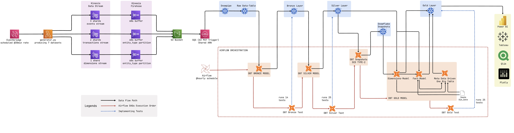

---

## Tech Stack

| Layer | Technology | Purpose |
|---|---|---|
| Scheduling | AWS EventBridge | Triggers Lambda every 30 minutes |
| Compute | AWS Lambda (Python 3.12) | Synthetic data generation and Kinesis publishing |
| Streaming | AWS Kinesis Data Streams (3) | Durable ordered record storage, 7-day retention |
| Delivery | AWS Kinesis Firehose (3) | 60s buffering + dynamic S3 partitioning by entity |
| Storage | AWS S3 | Raw JSON files partitioned by entity and date |
| Auto-ingest | Snowpipe + SQS | Event-driven loading from S3 into Snowflake RAW |
| Data Warehouse | Snowflake | RAW → BRONZE → SILVER → GOLD → SNAPSHOTS schemas |
| Transformation | dbt Core 1.11 | Medallion architecture with incremental models |
| dbt Adapter | dbt-snowflake | Snowflake-specific SQL generation |
| Orchestration | Apache Airflow 2.9 | Scheduled DAG with test gates between layers |
| Python Env | uv | Fast Python + venv management |

---
## Architecture

```
EventBridge (every 30 min)
        │
        ▼
Lambda (Python 3.12) ── Faker + 10 dirty patterns ── 230 records/run
        │
        ├──► airbnb-events-stream      (3 shards)  → 50 listing_events
        ├──► airbnb-transactions-stream (2 shards) → 5 new bookings + 10 updates + 30 reviews
        └──► airbnb-dimensions-stream  (1 shard)   → 10 listings + 5 hosts + 20 guests + 100 calendar
                    │
                    ▼
        Kinesis Firehose (60s buffer, dynamic partitioning on entity_type)
                    │
                    ▼
        S3: s3://airbnb-de-project-nirmal/airbnb/{entity_type}/year=/month=/day=/
                    │
                    ▼  (SQS notification on PUT)
        Snowpipe (AUTO_INGEST=TRUE, 7 pipes, shared SQS queue)
                    │
                    ▼
        Snowflake AIRBNB_DE.RAW (7 tables — all VARCHAR)
                    │
                    ▼  (Airflow DAG every 12 hours)
        dbt Bronze → dbt Silver → dbt Snapshot (SCD-2) → dbt Gold
                    │
                    ▼
        Star Schema: 3 Dimensions + 1 Date + 3 Facts + 1 OBT
```
---

## Pipeline Metrics

| Metric | Value |
|---|---|
| Datasets generated | 7 (hosts, listings, guests, bookings, reviews, calendar, events) |
| RAW tables | 7 |
| Total columns across RAW | 138 |
| Records per Lambda run | 230 |
| Lambda trigger frequency | Every 30 minutes (EventBridge) |
| Records per hour | ~460 |
| Breakdown per run | 50 events · 5 new bookings · 10 booking updates · 30 reviews · 10 listings · 5 hosts · 20 guests · 100 calendar |
| Kinesis streams | 3 (events: 3 shards · transactions: 2 shards · dimensions: 1 shard) |
| Firehose delivery streams | 3 (60s buffer · dynamic entity_type partitioning) |
| dbt models | 21 |
| dbt data quality tests | 64 (Bronze: 14 · Silver: 25 · Gold: 25) |
| Dirty data patterns designed in | 10 |
| Pipeline schedule | Every 6 hours (`0 */6 * * *`) |
| Airflow DAG tasks | 7 (with test gates between each layer) |

---

## Project Structure

```
airbnb-streaming-de-project/
│
├── lambda/
│   ├── generator.py          # Faker-based data generator with 10 dirty patterns
│   └── lambda_handler.py     # AWS Lambda entry point
│
├── airbnb_de_project_dbt/
│   ├── models/
│   │   ├── bronze/           # 7 incremental models — dedup + watermark
│   │   ├── silver/           # 7 incremental models — all dirty patterns fixed
│   │   └── gold/             # 3 dimensions + 3 facts + 1 OBT
│   ├── snapshots/
│   │   ├── hosts_snapshot.sql     # SCD-2 on is_superhost, response_rate
│   │   └── listings_snapshot.sql  # SCD-2 on price_per_night, cancellation_policy
│   ├── seeds/
│   │   └── dim_date.csv      # 3,288 rows, 2020–2028
│   ├── tests/
│   │   ├── assert_booking_dates_valid.sql
│   │   ├── assert_ratings_in_range.sql
│   │   ├── assert_revenue_positive.sql
│   │   ├── assert_silver_hosts_no_duplicates.sql    # gates snapshot
│   │   └── assert_silver_listings_no_duplicates.sql # gates snapshot
│   ├── macros/
│   │   └── generate_schema_name.sql  # prevents dbt_schema_bronze naming
│   ├── dbt_project.yml
│   └── packages.yml
│
├── airflow_dags/
│   └── airbnb_dbt_pipeline.py  # 7-task DAG with test gates
│
├── profiles_example.yml       # Snowflake connection template
└── README.md
```

---

##  Gold Layer — Star Schema Design

```
                    ┌─────────────┐
                    │  dim_date   │
                    │             │
                    └──────┬──────┘
                           │
┌─────────────┐     ┌──────▼──────┐     ┌─────────────┐
│  dim_hosts  │     │fct_bookings │     │  dim_guests │
│  (SCD-2)    ├────►│             │◄────│             │
└─────────────┘     └──────┬──────┘     └─────────────┘
                           │
┌─────────────┐            │
│ dim_listings│◄───────────┘
│  (SCD-2)    │
└─────────────┘

Also: fct_reviews  · fct_listing_events · obt_bookings
```

### Key design decisions

- **SCD-2 on hosts and listings only** — Superhost status and listing price changes affect revenue attribution. Guest profile changes are data corrections, not analytical state changes.
- **Surrogate keys via MD5** — `MD5(host_id || '|' || dbt_valid_from)` creates a version-specific key, preventing the duplicate row problem on SCD-2 joins.
- **Metadata-driven OBT** — 48-column `gold_obt_bookings` is generated via a Jinja `for` loop over `dbt_project.yml` vars. Adding a column = one line of YAML, zero SQL changes.
- **3 separate fact tables** — bookings, reviews, and listing events are distinct business processes with different grains. Mixing them would produce an 80% NULL table with an undefined grain.

---

## Airflow DAG

7 tasks in a sequential chain with test gates — if any test fails, downstream layers are skipped. Bad data never propagates forward.

```
bronze_run → bronze_test → silver_run → silver_test → snapshot → gold_run → gold_test
```

- Schedule: `0 */6 * * *` (midnight and noon every day)
- Retry: 1 automatic retry with 5-minute delay
- Each task is a BashOperator calling dbt with full path resolution

### Airflow DAG Screenshot

> 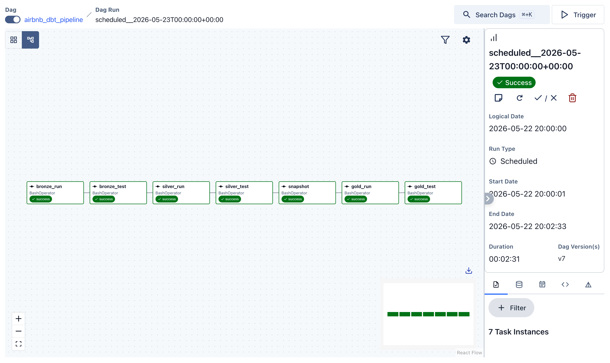

---

## dbt Lineage Graph

The full lineage from 7 RAW sources through Bronze, Silver, Snapshots, and Gold — 21 models, all dependencies tracked automatically.

> 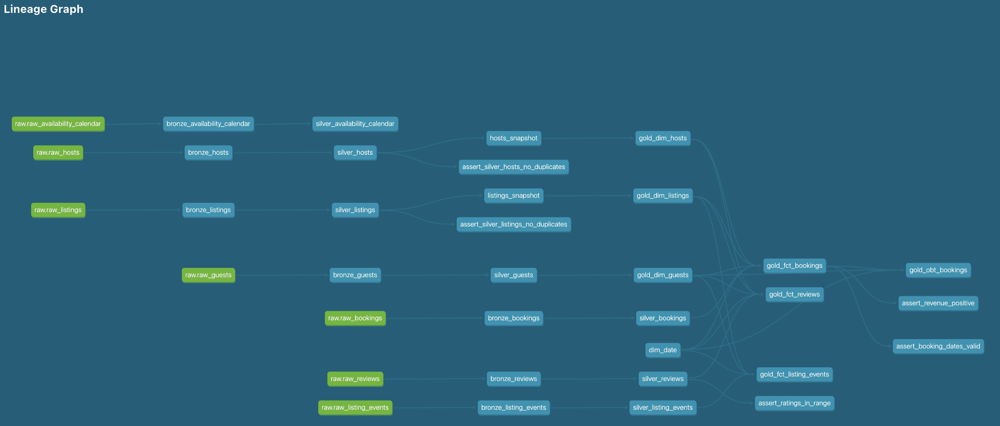

---

## AWS and Snowflake Infrastructure Screenshots

### 1 - AWS Infrastructure
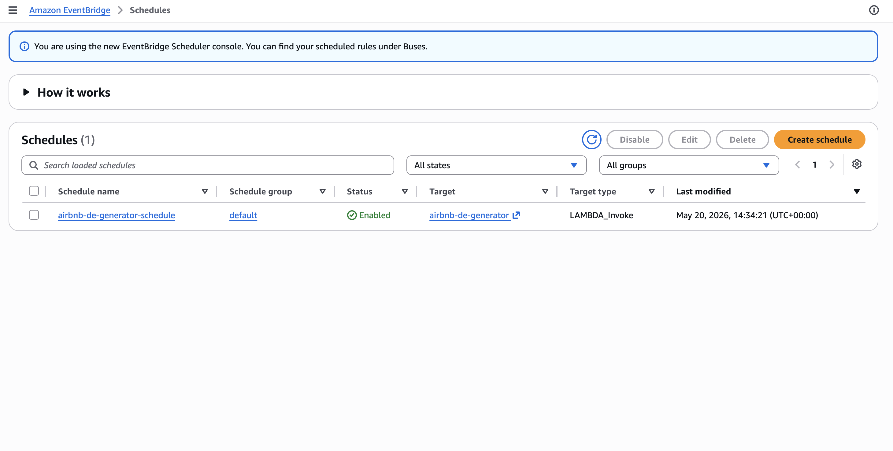
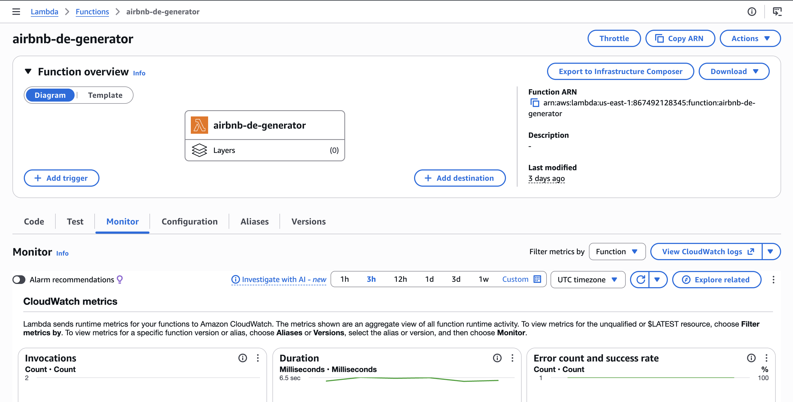
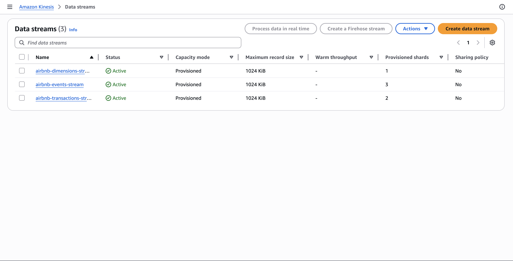
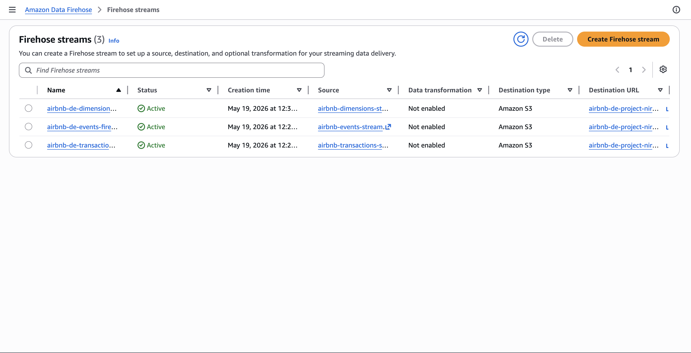
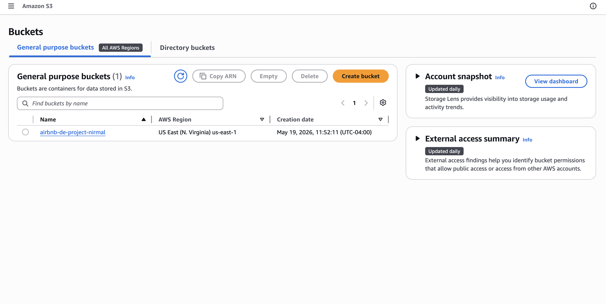
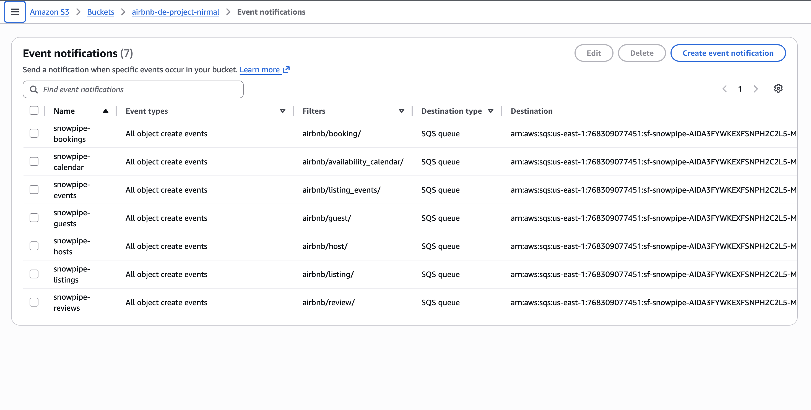

### 2 - Snowflake Snowpipe, Schema and Tables
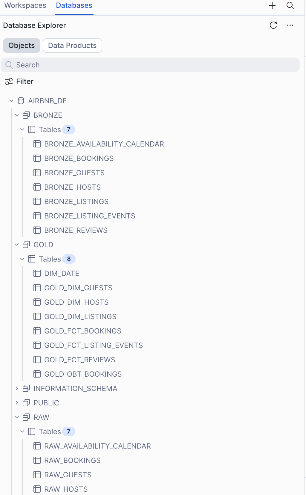
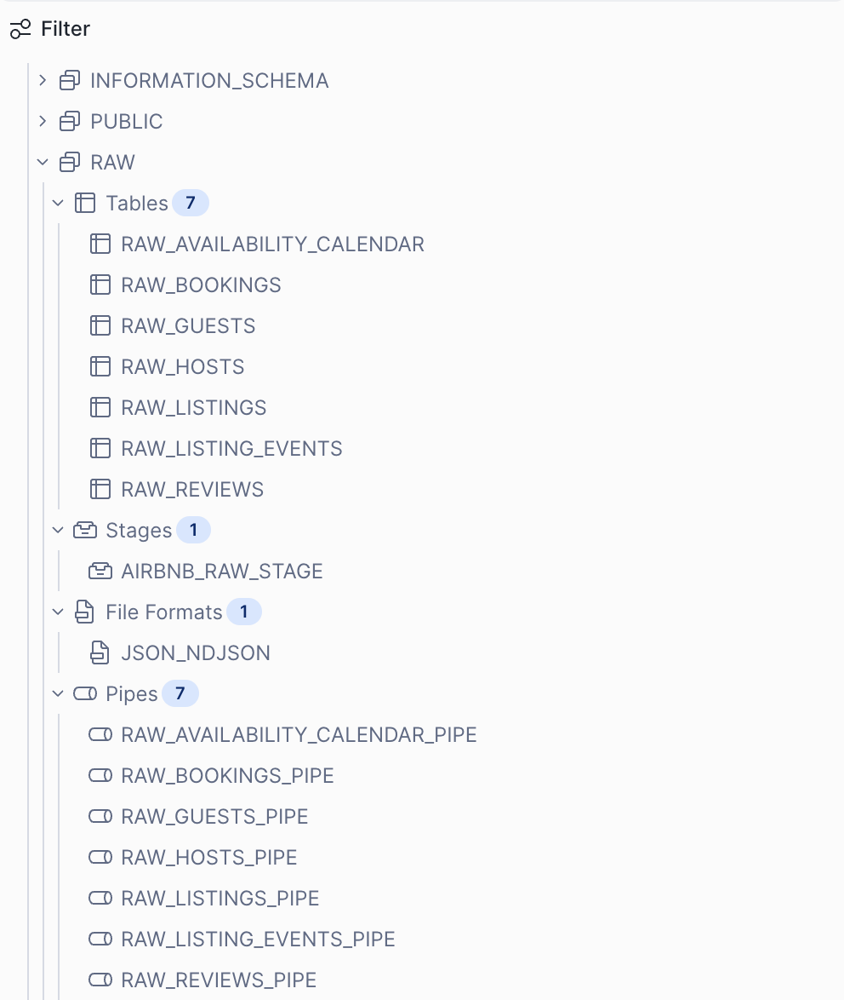


## Setup Instructions

### Prerequisites

- AWS account with permissions for Lambda, Kinesis, S3, EventBridge
- Snowflake account (free trial works)
- Python 3.12
- uv package manager

### 1 — Clone the repo

```bash
git clone https://github.com/YOUR_USERNAME/airbnb-streaming-de-project.git
cd airbnb-streaming-de-project
```

### 2 — Set up Python environment

```bash
uv python install 3.12
uv venv --python 3.12
source .venv/bin/activate
uv pip install dbt-snowflake apache-airflow faker boto3
```

### 3 — Configure Snowflake connection

```bash
cp profiles_example.yml ~/.dbt/profiles.yml
# Edit ~/.dbt/profiles.yml with your Snowflake credentials
```

### 4 — Set up AWS infrastructure

1. Create S3 bucket `airbnb-de-project-yourname`
2. Create 3 Kinesis streams: `airbnb-events-stream` (3 shards), `airbnb-transactions-stream` (2 shards), `airbnb-dimensions-stream` (1 shard)
3. Create 3 Firehose delivery streams reading from each Kinesis stream, writing to S3
4. Create Lambda function from `lambda/` folder, attach IAM role with `kinesis:PutRecords`
5. Create EventBridge rule: `rate(30 minutes)` → Lambda

### 5 — Set up Snowflake

```sql
CREATE DATABASE AIRBNB_DE;
CREATE WAREHOUSE AIRBNB_WH WITH WAREHOUSE_SIZE = 'X-SMALL' AUTO_SUSPEND = 60;
-- Run RAW table DDL and Snowpipe setup
-- See full setup in sql_code file/
```

### 6 — Run dbt pipeline

```bash
cd airbnb_de_project_dbt
dbt deps          # install dbt-utils
dbt seed          # load dim_date (3,288 rows)
dbt run           # build all 21 models
dbt snapshot      # build SCD-2 snapshots
dbt test          # run all 64 tests
dbt docs generate && dbt docs serve  # view lineage graph
```

### 7 — Start Airflow

```bash
airflow db migrate
mkdir ~/airflow/dags
cp airflow_dags/airbnb_dbt_pipeline.py ~/airflow/dags/
airflow standalone  
```

---

## Run the Tests

```bash
dbt test                           # all 64 tests
dbt test --select "bronze.*"       # bronze layer — 14 tests
dbt test --select "silver.*"       # silver layer — 25 tests
dbt test --select "gold.*"         # gold layer  — 25 tests
```

All 64 tests pass including 5 custom singular tests:
- `assert_booking_dates_valid` — no completed bookings with check_out before check_in
- `assert_ratings_in_range` — all ratings on 0–5 scale after Silver normalisation
- `assert_revenue_positive` — all completed bookings have positive revenue
- `assert_silver_hosts_no_duplicates` — no duplicate host_ids in Silver (gates snapshot)
- `assert_silver_listings_no_duplicates` — no duplicate listing_ids in Silver (gates snapshot)

---

##  Key Technical Decisions

**All RAW columns are VARCHAR.** If Snowpipe encounters a type mismatch, it silently drops the record. VARCHAR prevents silent data loss — every record lands regardless of how dirty the values are. Type casting happens in Silver using `TRY_TO_DECIMAL` and `TRY_TO_DATE`, which return NULL on failure instead of crashing.

**COALESCE on all incremental watermarks.** `MAX(_loaded_at)` on an empty table returns NULL, making `WHERE _loaded_at > NULL` evaluate to NULL for every row — a silent no-op. Wrapping in `COALESCE(MAX(_loaded_at), '2000-01-01'::TIMESTAMP_TZ)` ensures the first run processes all records.

**Seeded UUID pools in the generator.** `random.Random(42)` produces identical ID pools on every Lambda invocation, guaranteeing FK overlap between bookings and listings across runs. Without this, near-zero join matches in Gold.

**Dedup CTEs on all Silver models.** The Snowflake snapshot command fails with error 100090 if duplicate rows exist on the unique key. All 7 Silver models include a `ROW_NUMBER() PARTITION BY [unique_key] ORDER BY _loaded_at DESC` dedup CTE. Two singular tests (`assert_silver_hosts_no_duplicates`, `assert_silver_listings_no_duplicates`) run as a gate in the Airflow DAG before the snapshot task — if duplicates exist, the pipeline stops before the snapshot ever runs.

**Separate fact tables for separate business processes.** Bookings, reviews, and listing events have different grains, different metrics, and different analytical questions. Merging them produces an undefined grain and an 80% NULL table.

---

## Author

**Nirmalkumar Thirupallikrishnan Kesavan**
